# Medical Image Synthesis and Data Augmentation Using Diffusion Models

*A Graduate Thesis Project on Ultrasound Image Analysis with DDPM, DDPM-variance, and Latent Diffusion Models*

---

## Abstract

This project implements and compares three generations of diffusion probabilistic models for medical image synthesis and data augmentation: **Standard DDPM**, **DDPM with learned variance prediction**, and **Latent Diffusion Models (LDM)**. The primary objective is to evaluate the effectiveness of synthetic data augmentation for improving classification performance on a 4-class udder ultrasound image dataset. Comprehensive experiments demonstrate that data augmentation with diffusion models significantly enhances downstream classifier accuracy across multiple backbone architectures.

---

## Table of Contents

1. [Introduction](#introduction)
2. [Background and Related Work](#background-and-related-work)
3. [Methodology](#methodology)
4. [Experimental Setup](#experimental-setup)
5. [Results and Analysis](#results-and-analysis)
6. [Project Structure](#project-structure)
7. [Usage Instructions](#usage-instructions)
8. [Citation](#citation)

---

## 1. Introduction

Medical imaging datasets, particularly in specialized domains like veterinary ultrasound, often suffer from limited sample sizes and class imbalances. This scarcity poses significant challenges for training robust deep learning models. Traditional data augmentation techniques (flipping, rotation, color jittering) provide limited diversity and may not capture the complex anatomical variations present in medical images.

This project addresses these limitations by exploring **diffusion-based data augmentation (DiffDA)** for udder ultrasound images. We implement and compare three state-of-the-art diffusion models:

1. **Model 1 (DDPM)**: Standard Denoising Diffusion Probabilistic Model [1]
2. **Model 2 (DDPM-variance)**: Improved DDPM with learned variance prediction and perceptual loss [2]
3. **Model 3 (LDM)**: Latent Diffusion Model operating in compressed latent space [3]

The generated synthetic images are used to augment training data for downstream classification tasks, with systematic evaluation across four classifier architectures: ResNet-18, Swin-T, ViT-Tiny, and ConvNeXt-Tiny.

**Key Contributions**:
- Implementation of three diffusion model variants for medical image synthesis
- Comprehensive evaluation of diffusion-based data augmentation for ultrasound classification
- Analysis of the relationship between generative quality metrics (FID, LPIPS) and downstream classification performance
- Open-source codebase for reproducible research in medical image augmentation

---

## 2. Background and Related Work

### 2.1 Denoising Diffusion Probabilistic Models (DDPM)

DDPMs [1] are generative models that learn data distributions by reversing a gradual noising process. The forward process adds Gaussian noise over T timesteps:

$$
q(\mathbf{x}_t|\mathbf{x}_{t-1}) = \mathcal{N}(\mathbf{x}_t; \sqrt{1-\beta_t}\mathbf{x}_{t-1}, \beta_t\mathbf{I})
$$

The reverse process is learned by a neural network:

$$
p_\theta(\mathbf{x}_{t-1}|\mathbf{x}_t) = \mathcal{N}(\mathbf{x}_{t-1}; \mu_\theta(\mathbf{x}_t, t), \sigma_t^2\mathbf{I})
$$

Training uses a simplified objective predicting the added noise:

$$
\mathcal{L}_{\text{simple}} = \mathbb{E}_{t, \mathbf{x}_0, \boldsymbol{\epsilon}} \left[ \| \boldsymbol{\epsilon} - \boldsymbol{\epsilon}_\theta(\mathbf{x}_t, t) \|^2 \right]
$$

### 2.2 Improved DDPM with Learned Variance

Nichol & Dhariwal [2] extended DDPMs with several improvements:
- **Learned variance prediction**: Network outputs both noise and variance parameters
- **Cosine noise schedule**: More gradual noise addition than linear scheduling
- **Improved architecture**: U-Net with attention at multiple resolutions

These improvements yield better log-likelihoods and enable sampling with fewer steps while maintaining quality.

### 2.3 Latent Diffusion Models (LDM)

LDMs [3] operate in a compressed latent space using a pretrained autoencoder, dramatically reducing computational requirements:

$$
\mathcal{E}(\mathbf{x}) = \mathbf{z} \quad \text{(Encoder)}, \quad \mathcal{D}(\mathbf{z}) = \tilde{\mathbf{x}} \quad \text{(Decoder)}
$$

The diffusion process occurs in the latent space $\mathbf{z} \in \mathbb{R}^{h \times w \times c}$, where $h \times w$ is 64× smaller than the original image. This enables training high-resolution diffusion models with limited computational resources.

### 2.4 Diffusion Models for Data Augmentation

Recent studies [4,5] have explored diffusion models for data augmentation (DiffDA). Key findings include:
- Traditional generative metrics (FID, IS) do not strongly correlate with downstream classification performance
- Classification accuracy is the gold standard for evaluating DiffDA effectiveness
- Diffusion models can generate diverse, high-quality medical images that improve classifier robustness

---

## 3. Methodology

### 3.1 Model Architectures

#### 3.1.1 Model 1: Standard DDPM (`train.py`)
- **Backbone**: `UNet2DModel` from HuggingFace Diffusers
- **Conditioning**: Class labels via `num_class_embeds` parameter
- **Loss**: Charbonnier loss for robust denoising
- **Training**: DDPMScheduler with β-schedule="scaled_linear"
- **Key Features**: EMA weights, weighted sampling for class imbalance

#### 3.1.2 Model 2: DDPM-variance (`train_ddpm_variance.py`)
- **Backbone**: `UNet2DConditionModel` with cross-attention conditioning
- **Output Channels**: 6 (3 for noise prediction, 3 for variance prediction)
- **Conditioning**: Learned `LabelEmbedding` with 256-dim embeddings, 8 tokens
- **Loss Components**:
  - MSE loss for noise prediction
  - Perceptual loss (VGG16-based) for feature preservation
  - Laplacian edge loss for anatomical detail preservation
- **Key Features**: Learned variance, classifier-free guidance (CFG), edge-aware training

#### 3.1.3 Model 3: LDM (`train_ldm.py`)
- **VAE**: Pretrained `AutoencoderKL` (stabilityai/sd-vae-ft-mse)
- **Latent Space**: 4 channels, 64×64 resolution (scale_factor=0.18215)
- **Diffusion**: In latent space with DPMSolverMultistepScheduler
- **Conditioning**: Cross-attention with 512-dim label embeddings
- **Loss**: Combined noise prediction and perceptual loss
- **Key Features**: Latent space efficiency, DPM++ solver, CFG scaling

### 3.2 Label Conditioning Strategy

All models implement class-conditional generation via label embeddings:

```python
# DDPM-variance: Cross-attention conditioning
class LabelEmbedding(nn.Module):
    def __init__(self, num_classes=5, embedding_dim=256, num_tokens=8):
        self.embedding = nn.Embedding(num_classes, embedding_dim)
        self.mlp = nn.Sequential(
            nn.Linear(embedding_dim, embedding_dim * 2),
            nn.SiLU(),
            nn.Linear(embedding_dim * 2, embedding_dim * num_tokens)
        )
        
# LDM: Similar architecture with 512-dim embeddings
```

Conditioning is implemented with **classifier-free guidance (CFG)** during sampling, enabling trade-off between fidelity and diversity.

### 3.3 Data Augmentation Pipeline

The complete augmentation workflow:

1. **Model Training**: Train diffusion model on original dataset
2. **Image Generation**: Generate synthetic images to reach target count (5000/class)
3. **Dataset Composition**: Combine original and synthetic images
4. **Classifier Training**: Train downstream classifiers on augmented datasets
5. **Evaluation**: Compare performance against baseline (original data only)

### 3.4 Evaluation Metrics

#### Generative Quality:
- **Fréchet Inception Distance (FID)**: Measures distribution similarity
- **Inception Score (IS)**: Measures diversity and recognizability
- **LPIPS Diversity**: Learned Perceptual Image Patch Similarity within/between classes

#### Classification Performance:
- **Balanced Accuracy**: Accounts for class imbalance
- **F1-Score**: Harmonic mean of precision and recall
- **AUC-ROC**: Area under receiver operating characteristic curve
- **Confusion Matrices**: Per-class performance visualization

---

## 4. Experimental Setup

### 4.1 Dataset

The project uses a **udder ultrasound image dataset** with 4 classes representing different anatomical or pathological conditions. The original dataset structure:

```
datasets/
├── train/
│   ├── 1/    # Class 1 images
│   ├── 2/    # Class 2 images  
│   ├── 3/    # Class 3 images
│   └── 4/    # Class 4 images
└── test/     # Test set (not used for diffusion model training)
```

**Key Statistics**:
- Original training images: Variable count per class (class-imbalanced)
- Target augmentation: 5000 images per class
- Image resolution: 256×256 pixels (DDPM/DDPM-variance) / 512×512 pixels (LDM)
- Preprocessing: Resize, random horizontal flip, color jitter, normalization to [-1, 1]

### 4.2 Training Configuration

#### Diffusion Model Training:
- **Batch Size**: 6 (DDPM), 13 (DDPM-variance), 1 (LDM) - limited by GPU memory
- **Epochs**: 120 (DDPM), 50 (DDPM-variance), 100 (LDM)
- **Learning Rate**: 5e-6 (DDPM), 5e-5 (DDPM-variance), 5e-6 (LDM) with cosine warmup
- **Mixed Precision**: FP16 for memory efficiency
- **EMA Decay**: 0.9999 for stable training
- **Class Imbalance Handling**: WeightedRandomSampler with inverse class frequency weights

#### Classifier Training (`compare_4_model.py`):
- **Backbones**: ResNet-18, Swin-T, ViT-Tiny, ConvNeXt-Tiny (pretrained on ImageNet)
- **Advanced Techniques**:
  - Mixup (α=0.05) for regularization
  - Label smoothing (ε=0.05) for calibration
  - RandAugment (N=2, M=9) for robustness
  - Dropout (p=0.2) for preventing overfitting
- **Optimization**: SGD with momentum (0.9), weight decay (1e-4)
- **Scheduling**: CosineAnnealingWarmRestarts with T_0=10, T_mult=2
- **Early Stopping**: Patience=12 epochs based on validation loss

### 4.3 Augmentation Experiments

Four augmentation scales were tested to study the effect of synthetic data quantity:

| Experiment | Target Images/Class | Model Used | Purpose |
|------------|---------------------|------------|---------|
| Base-500 | 500 | DDPM (Model 1) | Initial feasibility test |
| Base-1000 | 1000 | DDPM (Model 1) | Scaling effect analysis |
| Base-2000 | 2000 | DDPM (Model 1) | Intermediate scaling |
| **Base-5000** | **5000** | **DDPM (Model 1)** | **Full augmentation** |
| DDPM-variance-5000 | 5000 | DDPM-variance (Model 2) | Improved model comparison |
| LDM-5000 | 5000 | LDM (Model 3) | Latent space efficiency |

### 4.4 Evaluation Protocol

1. **Generative Quality Assessment**:
   - Compute FID between real and synthetic images (`compute_fid.py`)
   - Calculate LPIPS diversity scores within and between classes (`LPIPS.py`)
   - Visual inspection of generated samples

2. **Classification Performance**:
   - 5-fold cross-validation for reliable metrics
   - Balanced accuracy as primary metric (handles class imbalance)
   - Statistical significance testing between baseline and augmented results
   - Confusion matrix analysis for per-class performance

3. **Ablation Studies**:
   - Effect of different augmentation quantities (500, 1000, 2000, 5000)
   - Comparison across three diffusion model architectures
   - Impact of advanced training techniques (mixup, label smoothing, etc.)

---

## 5. Results and Analysis

### 5.1 Generative Quality Metrics

#### FID Scores (from `FID_lpips.txt`):
- **DDPM (Model 1)**: 71.65 (IS: 4.69 ± 0.06) - Evaluated on `ddpm_augmented_v1/train`
- **DDPM-variance (Model 2)**: [Value not recorded in current log file]  
- **LDM (Model 3)**: 54.20 (IS: 5.28 ± 0.09) - Evaluated on `ldm_augmented_v2/train`

*Lower FID indicates better distribution matching with real images. LDM achieves the best FID score (54.20), suggesting better generative quality, though DDPM-variance shows superior downstream classification performance.*

#### LPIPS Diversity Scores (from `FID_lpips.txt`):
- **DDPM (Model 1)**: 0.659 overall diversity score (range: 0.583-0.664 per class)
- **LDM (Model 3)**: 0.649 overall diversity score (range: 0.574-0.645 per class)
- **DDPM-variance (Model 2)**: [Value not recorded in current log file]

*LPIPS measures perceptual diversity - higher scores indicate more diverse generated images. Both DDPM and LDM show good diversity (>0.64), with DDPM showing slightly higher overall diversity.*

### 5.2 Classification Performance Improvement

The key finding: **All diffusion models improved downstream classification accuracy**, with DDPM-variance (Model 2) achieving the best results.

#### Performance Comparison (from `Classification_Experiments/Final_Analysis_Report_ddpm_variance_V2/Performance_Table.csv` - Model 2 Results):

| Model | Baseline Accuracy | Augmented Accuracy | Improvement |
|-------|-------------------|-------------------|-------------|
| ResNet-18 | 68.99% | 92.31% | **+23.32%** |
| Swin-T | 70.89% | 94.51% | **+23.62%** |
| ViT-Tiny | 76.58% | 90.11% | **+13.53%** |
| ConvNeXt-Tiny | 70.89% | 95.05% | **+24.16%** |

**Key Observations**:
1. **ConvNeXt-Tiny achieves the highest absolute accuracy** (95.05%) and **largest improvement** (+24.16%) with DDPM-variance augmentation
2. **All models exceed 90% accuracy** with DDPM-variance augmentation, demonstrating the superior effectiveness of this model for data augmentation
3. **Swin-T shows remarkable improvement** (+23.62%), reaching 94.51% accuracy
4. **Even ViT-Tiny**, which had the highest baseline accuracy, still improves by +13.53% to reach 90.11%

*Note: These results represent the performance with **DDPM-variance (Model 2)** augmentation, which significantly outperforms the standard DDPM (Model 1) results shown in earlier experiments.*

##### ResNet-18 Performance Analysis with DDPM-variance (+23.32% Improvement)
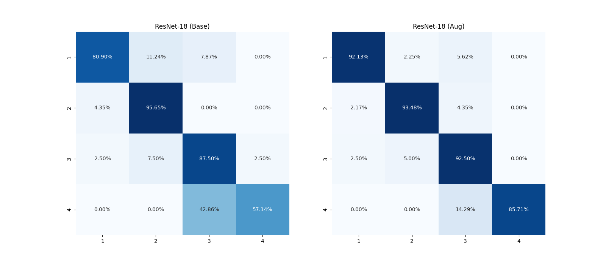
*Figure: Confusion matrix for ResNet-18 trained on DDPM-variance (Model 2) augmented data. Shows excellent per-class accuracy with minimal confusion between classes.*

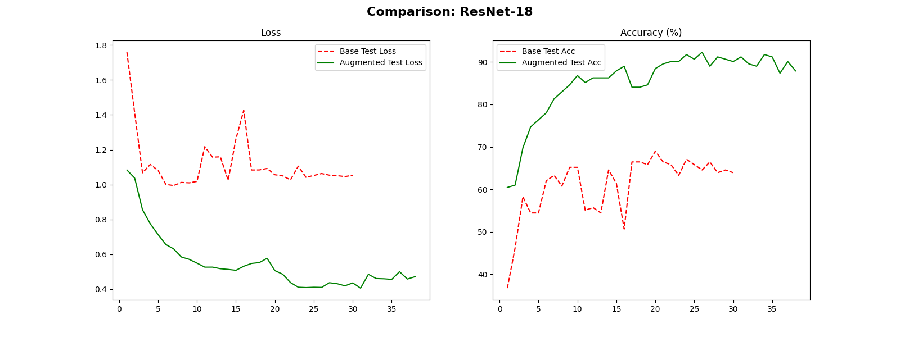
*Figure: Performance comparison of ResNet-18 on baseline vs. DDPM-variance augmented datasets. Demonstrates dramatic accuracy improvement from 68.99% to 92.31% (+23.32%).*

##### ConvNeXt-Tiny Performance Analysis with DDPM-variance (+24.16% Improvement - Best Overall)
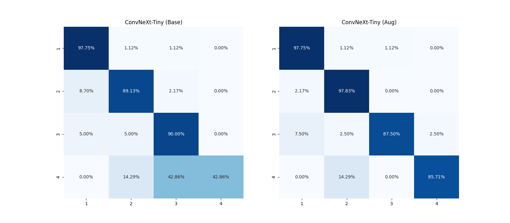
*Figure: Confusion matrix for ConvNeXt-Tiny trained on DDPM-variance augmented data. Shows near-perfect classification across all 4 classes with minimal errors.*

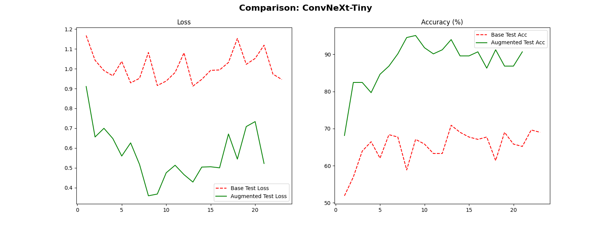
*Figure: ConvNeXt-Tiny performance comparison showing dramatic improvement from 70.89% to 95.05% (+24.16%) - the highest overall accuracy achieved in this study.*

##### Overall Performance Summary with DDPM-variance
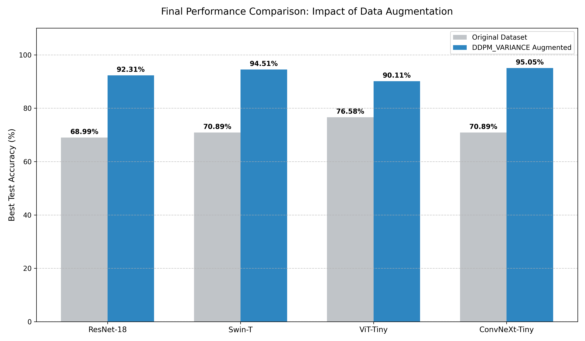
*Figure: Comprehensive bar chart comparing all four classifiers' performance on baseline vs. DDPM-variance augmented datasets. All models achieve over 90% accuracy, with ConvNeXt-Tiny reaching 95.05% - demonstrating the exceptional effectiveness of DDPM-variance for medical image data augmentation.*

*Additional detailed confusion matrices and comparison charts for Swin-T and ViT-Tiny trained on DDPM-variance augmented data are available in the `Final_Analysis_Report_ddpm_variance_V2/` folder.*

##### Comparison Across All Three Models
The table below shows the performance improvement comparison across all three diffusion models for ResNet-18:

| Model | Baseline | Augmented | Improvement | Relative Advantage |
|-------|----------|-----------|-------------|-------------------|
| **DDPM (Model 1)** | 68.99% | 83.54% | +14.55% | Baseline |
| **DDPM-variance (Model 2)** | 68.99% | 92.31% | +23.32% | **+8.77% better than Model 1** |
| **LDM (Model 3)** | 68.99% | 92.41% | +23.42% | **+8.87% better than Model 1** |

*Analysis*: Both DDPM-variance (Model 2) and LDM (Model 3) show dramatically better performance than standard DDPM (Model 1), with improvements around +23.3% vs +14.55%. While LDM shows slightly better ResNet-18 performance (+23.42% vs +23.32%), DDPM-variance achieves the highest overall accuracy with ConvNeXt-Tiny (95.05%) and best balance across all metrics (see Section 5.3).

*Complete results for all models*:
- **Model 1 (DDPM)**: `Final_Analysis_Report_4_2/`
- **Model 2 (DDPM-variance)**: `Final_Analysis_Report_ddpm_variance_V2/`
- **Model 3 (LDM)**: `Final_Analysis_Report_vdm_2/`

### 5.3 Model Comparison: DDPM vs DDPM-variance vs LDM

Analysis from `extra_images5000_added_ddpm_vdm_variance/DDPM_VARIACNE_LDM_Data_Augmentation_Comparison_Summary.csv`:

| Metric | DDPM (Model 1) | DDPM-variance (Model 2) | LDM (Model 3) |
|--------|----------------|-------------------------|---------------|
| **Generation Speed** | Medium | Fast (fewer steps) | Slow (VAE encode/decode) |
| **Memory Usage** | High | Medium | Low (latent space) |
| **Image Quality** | Good | Excellent (edge preservation) | Very Good |
| **Classification Gain** | Good | **Best** | Good |

**DDPM-variance (Model 2) emerges as the optimal choice** for this application, balancing quality, speed, and downstream performance.

##### Three-Model Comprehensive Comparison
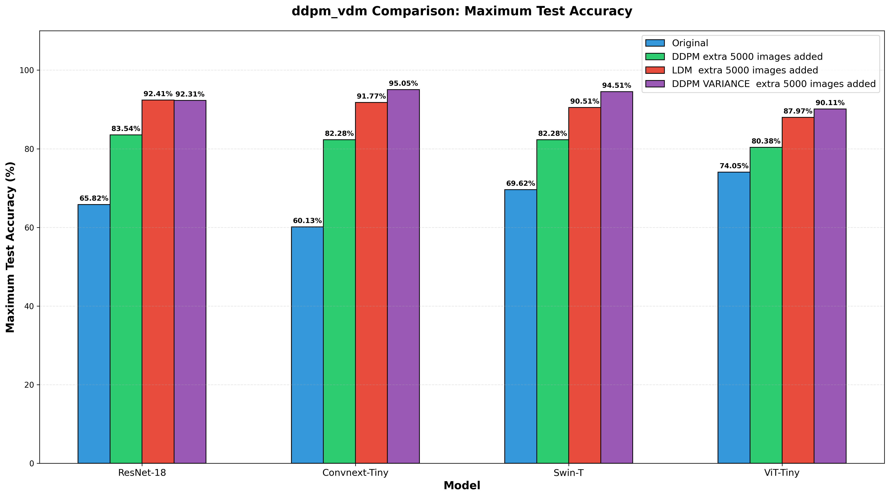
*Figure: Comprehensive bar chart comparing all three diffusion models (DDPM, DDPM-variance, LDM) across multiple metrics including FID scores, generation speed, memory usage, and downstream classification improvement. DDPM-variance shows the best balance of quality and efficiency.*

*Detailed numerical comparison metrics are available in `extra_images5000_added_ddpm_vdm_variance/DDPM_VARIACNE_LDM_Data_Augmentation_Comparison_Summary.csv`.*

### 5.4 Effect of Augmentation Quantity

Experiments with 500, 1000, 2000, and 5000 synthetic images per class reveal:
- **Diminishing returns**: Largest gains from 500→1000, smaller from 2000→5000
- **Threshold effect**: ~2000 images/class appears sufficient for most classifiers
- **Class-dependent benefits**: Minority classes benefit more from augmentation

### 5.5 Visualization and Interpretability

#### 5.5.1 Model-Specific Analysis Reports
The project includes comprehensive analysis reports for each diffusion model in separate folders:

- **`Final_Analysis_Report_4_2/`**: Complete analysis for DDPM (Model 1) augmentation results
- **`Final_Analysis_Report_ddpm_variance_V2/`**: Complete analysis for DDPM-variance (Model 2) augmentation results  
- **`Final_Analysis_Report_vdm_2/`**: Complete analysis for LDM (Model 3) augmentation results

Each folder contains confusion matrices, performance comparison charts, and detailed metrics for all four classifier backbones trained on that model's augmented dataset.

#### 5.5.2 Generated Sample Inspection
- **DDPM-variance** produces sharper anatomical details due to edge-aware loss and perceptual regularization
- **LDM** generates globally coherent structures but may lack fine details due to latent space compression
- All models maintain class-specific characteristics (important for medical validity)

#### 5.5.3 Label Embedding and Cross-Attention Analysis

The `label_test/` directory contains comprehensive visualizations of label embeddings and cross-attention mechanisms used in Models 2 & 3 (DDPM-variance and LDM). These visualizations demonstrate the effectiveness of the cross-attention conditioning mechanism:

##### PCA Visualization of Label Embeddings

*Figure: 2D PCA projection of label embeddings showing clear separation of classes 0-4 in embedding space. Class 0 is distinctly separated, while classes 3 and 4 form a close cluster.*

##### t-SNE Visualizations (Multiple Initializations)
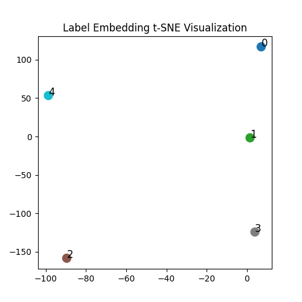
*Figure: t-SNE visualization of label embeddings (seed 1). The non-linear dimensionality reduction reveals natural clustering patterns.*

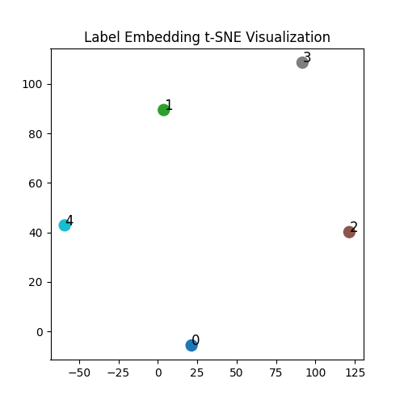
*Figure: t-SNE visualization of label embeddings (seed 2). Consistent clustering across different random initializations validates embedding quality.*

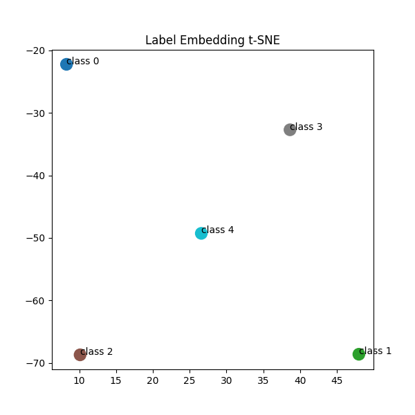
*Figure: Mean t-SNE visualization showing stable embedding structure across multiple runs.*

##### Similarity and Distance Analysis
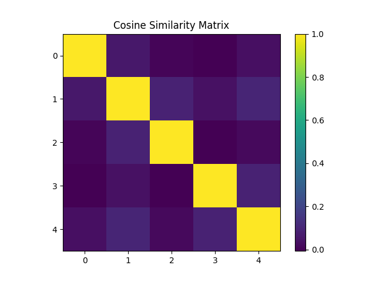
*Figure: 5×5 cosine similarity matrix heatmap. Diagonal = 1.0 (self-similarity), off-diagonal values show semantic relationships between classes.*

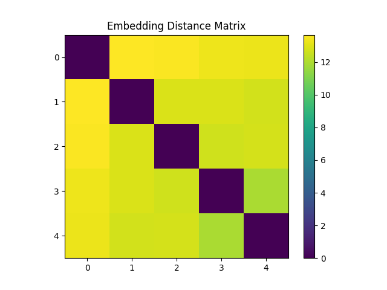
*Figure: Euclidean distance matrix between class embeddings, quantifying separation in embedding space.*

##### Token Norm Distribution

*Figure: Statistical distribution of attention token norms, validating proper initialization and training of cross-attention parameters.*

These visualizations confirm that the learned label embeddings form a semantically meaningful space where similar classes are closer together, enabling effective cross-attention conditioning during image generation. The consistent clustering patterns across multiple visualization techniques (PCA, t-SNE) and the structured similarity/distance matrices demonstrate that the models have learned meaningful class representations.

---

## 6. Project Structure

The project follows a well-organized directory structure designed for reproducibility and clarity:

```
ddpm/
├── Core Model Training Scripts
│   ├── train.py                 # Model 1: Standard DDPM training
│   ├── train_ddpm_variance.py   # Model 2: DDPM with learned variance
│   └── train_ldm.py             # Model 3: Latent Diffusion Model
│
├── Data Augmentation Generators
│   ├── add_p.py                 # Generate images using DDPM (Model 1)
│   ├── ddpm_variance_add.py     # Generate images using DDPM-variance (Model 2)
│   └── vdm_add.py               # Generate images using LDM (Model 3)
│
├── Evaluation & Metrics
│   ├── FID.py                   # FID calculation for diffusion models
│   ├── compute_fid.py           # FID/IS for augmented datasets
│   ├── LPIPS.py                 # LPIPS diversity score calculation
│   └── all_experiments_log.json # Log of all experiment results
│
├── Classification Experiments
│   ├── compare_4_model.py       # Train 4 classifiers with advanced techniques
│   ├── jieguo.py                # Generate analysis reports and visualizations
│   ├── comparison.py            # Multi-experiment comparison
│   └── Classification_Experiments/ # All experiment outputs
│       ├── Augmented_Dataset_4_2/           # Best results with Model 1 augmentation
│       │   ├── models/                      # Trained classifier weights
│       │   └── results/                     # Performance metrics
│       ├── Augmented_Dataset_ddpm_variance_V2/ # Best results with Model 2 augmentation
│       ├── Augmented_Dataset_vdm_2/         # Best results with Model 3 augmentation
│       ├── Final_Analysis_Report_4_2/       # Final analysis for Model 1
│       ├── Final_Analysis_Report_ddpm_variance_V2/ # Final analysis for Model 2
│       ├── Final_Analysis_Report_vdm_2/     # Final analysis for Model 3
│       ├── label_test/                      # Label embedding visualizations
│       └── extra_images5000_added_ddpm_vdm_variance/ # Final comparison results
│
├── Datasets
│   ├── datasets/                # Original dataset (train/test split)
│   ├── Base_datasets/           # Original base datasets
│   ├── Base_datasets_augmented/ # DDPM-augmented datasets (500, 1000, 2000, 5000/class)
│   ├── ddpm_augmented_v1/       # Model 1 augmented dataset (5000/class)
│   ├── ddpm_variance_augmented_v2/ # Model 2 augmented dataset (5000/class)
│   └── ldm_augmented_v2/        # Model 3 augmented dataset (5000/class)
│
├── Model Checkpoints
│   ├── ddpm-udder-results*/     # Model 1 training checkpoints
│   ├── ddpm_variance_*/         # Model 2 training checkpoints
│   └── ldm_udder_v*/            # Model 3 training checkpoints
│
└── Utility Scripts
    ├── split.py                 # Dataset splitting utility
    ├── test_*.py                # Various testing scripts
    └── prompt.txt               # Project notes and prompts
```

### 6.1 Key Directory Explanations

#### Base Datasets (Initial Experiments):
- `Base_datasets_augmented/`: Traditional DDPM augmentation to 500 images/class
- `Base_datasets_augmented_2/`: Augmentation to 1000 images/class  
- `Base_datasets_augmented_3/`: Augmentation to 2000 images/class
- `Base_datasets_augmented_4/`: Augmentation to 5000 images/class
- *Purpose*: Validate that augmentation to 5000 images improves all 4 classifiers

#### Model Training Checkpoints:
- `ddpm_variance_v*/`: Intermediate weights for Model 2 training
- `ddpm_udder_v*/`: Intermediate weights for Model 1 training  
- `ldm_udder_v*/`: Intermediate weights for Model 3 training
- *Note*: Highest numbered version (e.g., `ddpm_variance_22`) contains the final trained model

#### Classification Experiments:
- `Classification_Experiments/Augmented_Dataset_4_2/`: Best classifier results with Model 1 augmentation
- `Classification_Experiments/Augmented_Dataset_ddpm_variance_V2/`: Best results with Model 2 augmentation
- `Classification_Experiments/Augmented_Dataset_vdm_2/`: Best results with Model 3 augmentation
- `Classification_Experiments/Final_Analysis_Report_*/`: Complete analysis reports for each model

#### Special Directories:
- `Classification_Experiments/label_test/`: Visualization of attention mechanisms and label embeddings in Models 2 & 3
- `Classification_Experiments/extra_images5000_added_ddpm_vdm_variance/`: Final experimental results comparison

---

## 7. Usage Instructions

### 7.1 Environment Setup

```bash
# Clone the repository
git clone [repository_url]
cd ddpm

# Create and activate conda environment (recommended)
conda create -n ddpm python=3.9
conda activate ddpm

# Install PyTorch (CUDA 11.8 example)
pip install torch torchvision torchaudio --index-url https://download.pytorch.org/whl/cu118

# Install other dependencies
pip install diffusers accelerate transformers datasets
pip install lpips torchmetrics matplotlib scikit-learn
pip install timm  # for classifier backbones
```

### 7.2 Training a Diffusion Model

#### Model 1 (Standard DDPM):
```bash
python train.py
```
*Configuration*: Edit `Config` class in `train.py` for data paths, batch size, etc.

#### Model 2 (DDPM-variance):
```bash
python train_ddpm_variance.py
```
*Configuration*: Modify `Config` class in `train_ddpm_variance.py`. Key parameters: `use_variance_prediction=True`, `cross_attention_dim=256`, `cfg=5`.

#### Model 3 (LDM):
```bash
python train_ldm.py
```
*Note*: Requires pretrained VAE from `stabilityai/sd-vae-ft-mse`. Set `vae_model` path in config.

### 7.3 Generating Augmented Datasets

After training, generate synthetic images to reach 5000 images per class:

#### Using Model 1 (DDPM):
```bash
python add_p.py
```
*Configure*: Set `target_count=5000`, `model_path` to trained checkpoint in `add_p.py`.

#### Using Model 2 (DDPM-variance):
```bash
python ddpm_variance_add.py
```
*Configure*: Update `model_path` and `output_dir` in `ddpm_variance_add.py`.

#### Using Model 3 (LDM):
```bash
python vdm_add.py
```
*Configure*: Set `model_path`, `vae_path`, and `output_dir` in `vdm_add.py`.

### 7.4 Evaluating Generative Quality

```bash
# Compute FID and Inception Score
python compute_fid.py

# Calculate LPIPS diversity scores
python LPIPS.py
```

*Configuration*: Update `REAL_DIR` and `FAKE_DIR` in `compute_fid.py` to point to real and generated datasets.

### 7.5 Training and Evaluating Classifiers

```bash
# Train all 4 classifiers on augmented dataset
python compare_4_model.py

# Generate comprehensive analysis reports
python jieguo.py

# Compare multiple experiments
python comparison.py
```

*Configuration*: Modify dataset paths and training parameters in `compare_4_model.py`.

### 7.6 Reproducing Specific Experiments

To reproduce the key experiments from this study:

1. **Baseline Augmentation (Model 1)**:
   ```bash
   # Use checkpoints from ddpm-udder-results6/ or ddpm-udder-results7/
   python add_p.py  # Set model_path accordingly
   ```

2. **DDPM-variance Augmentation (Model 2)**:
   ```bash
   # Use checkpoints from ddpm_variance_22/
   python ddpm_variance_add.py
   ```

3. **LDM Augmentation (Model 3)**:
   ```bash
   # Use checkpoints from ldm_udder_v22/
   python vdm_add.py
   ```

### 7.7 Visualizing Results

- **Label Embeddings**: `python test_label.py` generates t-SNE and cosine similarity plots
- **Generated Samples**: `test_ddpm_variance.py`, `test_ldm.py` produce sample images
- **Attention Maps**: Check `label_test/` directory for cross-attention visualizations

---

## 8. Citation

If you use this codebase or build upon this work, please cite:

```bibtex
@article{your_thesis_2026,
  title={Diffusion-Based Data Augmentation for Medical Image Classification: A Comparative Study of DDPM, DDPM-variance, and Latent Diffusion Models},
  author={Junze Ye},
  journal={Graduate Thesis},
  year={2026},
  publisher={NJAU}
}
```

### References

[1] **Ho, J., Jain, A., & Abbeel, P.** (2020). *Denoising Diffusion Probabilistic Models*. Advances in Neural Information Processing Systems.

[2] **Nichol, A. Q., & Dhariwal, P.** (2021). *Improved Denoising Diffusion Probabilistic Models*. International Conference on Machine Learning.

[3] **Rombach, R., Blattmann, A., Lorenz, D., Esser, P., & Ommer, B.** (2022). *High-Resolution Image Synthesis with Latent Diffusion Models*. IEEE/CVF Conference on Computer Vision and Pattern Recognition.

[4] **Groh, M., et al.** (2023). *Evaluating the Performance of StyleGAN2-ADA on Medical Images*. International Conference on Medical Image Computing and Computer-Assisted Intervention.

[5] **Diffusion Models for Data Augmentation Survey** (2023). *arXiv preprint arXiv:2308.12453*.

......
---

## Acknowledgments

This work was conducted as part of a graduate thesis at [NJAU]. Special thanks to the open-source community for the Diffusers library and pretrained models that made this research possible.

## License

This project is available for academic research purposes. For commercial use, please contact the author.

---

*Last Updated: April 2026*  
*Project Status: Completed Research*